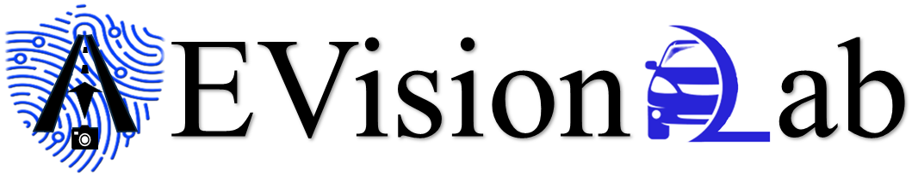
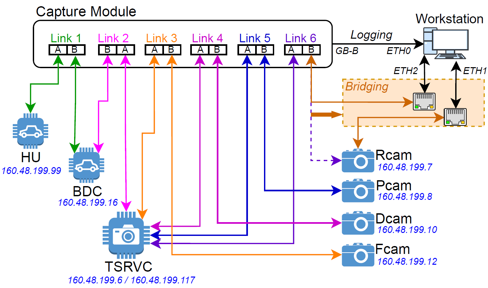
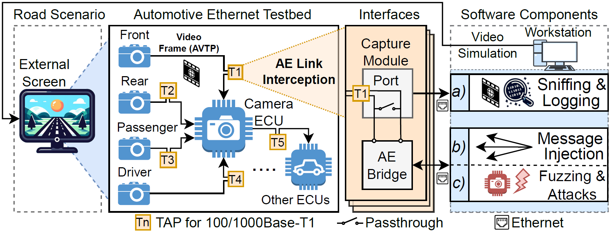

<p align="center">
  
</p>

# AEVisionLab Test Platform

This is the code repository for the paper titled *AEVisionLab: Manipulating In-vehicle Ethernet Networks with All-round Vision.* We are working in cleaning up the code and will make both the code and all experimental data available by 14 Aug 2024. 

---
# Below is *Work In Progress*

<p align="justify"> This is the code repository for the paper titled <i>AEVisionLab: Manipulating In-vehicle Ethernet Networks with All-round Vision.</i> AEVisionLab is a comprehensive test platform for Automotive Ethernet (AE) networks using commercial off-the-shelf (COTS) electronic control units (ECUs), that allow manipulation of messages over a realistic All-round Vision IVN,  targeted for security testing of AE protocols. The communication interfaces intercept Automotive Ethernet (AE) links between ECUs and send the intercepted messages to a workstation. Six AE links are monitored, with the capture module configured for 100Base-T1 sniffing. All messages from these links are monitored through the output port GB-B and captured by the workstation. </p>

<p align="center">
  
</p>

## Testing Setup

<p> The software component is designed with several key features. The testing setup depends on the operation of the test platform. </p>

<p align="center">
  
</p>

| Operation | Interface | Setup |
| :-------- | :---------- | :---------- |
| Sniffing & Logging | Capture Module | a) Capture Ethernet messages without disrupting the car’s normal operation and storing them in an appropriate format for subsequent inspection. |
| Interception, Injection & Modification | Bridging | b) Intercept or inject (modified) messages into targeted AE links through the workstation bidirectionally for testing and analysis at arbitrary intervals. |
| Fuzzing & Attacks | Bridging | c) Facilitate message fuzzing (e.g., modification). Likewise, message interception, modification, and injection can launch different targeted attacks. |

## Workstation Software

The software uses the libraries from PF_RING, libjpeg-turbo, and ffmpeg. The bridging and attack software of AEVisionLab is modified from PF_RING/userland/examples/pfbridge.c. The installation of the libraries is described in the following sections.

- [Installation of PF_RING & PF_RING/userland/examples Library](#Installation-of-PF_RING-&-PF_RING/userland/examples Library)

- [Installation of video simulation and libjpeg-turbo Library](#Installation-of-video-simulation-and-libjpeg-turbo-Library)

- [Installation of FFmpeg](#Installation-of-FFmpeg)

| Workstation Software | Description |
|:---------------|:------------|
| [Vision System Handler](#Vision-System-Handler) |The programs handle pass-through bridging, video monitoring, fuzzing, and protocol message extraction.|
| [Attack Software](#Attack-Software) |The programs are the attacks that are demonstrated on the test platform.|
| [Video Simulation Software](#Video-Simulation-Software) |The programs are used for video simulation in real-time or offline.|

### Vision System Handler
| Program | Interface | Description |
|:---------------|:------------|:------------|
| [pfbridge.c](./pfbridge.c) | Bridging | Extracted from the PF_Ring library, this program implements a one-directional pass-through from one Ethernet interface eth1 to another eth2. Usage: *sudo ./pfbridge -a eth1 -b eth2 -p* |
| [pf4CamV1.c](./pf4CamV1.c) | Capture Module | This program monitors the video of the four cameras in real time. The video packets of each camera are collected by the workstation and consolidated into an image frame. Continuous image frames are then displayed on the monitor to form a video stream. Usage: *sudo ./pf4CamV1 -a eth0 -p* |
| [pffuzzV1.c](./pffuzzV1.c) | Bridging | Once the targeted message for fuzzing is intercepted, this program performs random fuzzing of a byte in the message field of SomeIP or PTP protocol. In the program, the flags to enable the protocol fuzzing are someip_fuzz_enable and ptp_fuzz_enable. Usage: *sudo ./pffuzzV1 -a eth1 -b eth2 -p* |
| [pfProInfoV1.c](./pfProInfoV1.c) | Capture Module |This program processes the different protocols from selected or all links and saves them to separate files of someIP.txt, someIP-SD.txt, ptpV2.txt, avtp.txt, arp.txt, udp.txt, others.txt. Usage: *sudo ./pfProInfoV1 -a eth0 -p*|

### Attack Software
| Program | Interface | Description |
|:---------------|:------------|:------------|
| [pfCamDelayV1.c](./pfCamDelayV1.c) | Bridging | A bridge is established from a camera (eth1) to TSRVC (eth2). This program creates a one to five-second video buffer and continuously transmits a delayed video stream from the camera to TSRVC. The delay is user input. Usage: *sudo ./pfCamDelayAttkV1 -a eth1 -b eth2 -p* |
| [pfStopCamV1.c](./pfStopCamV1.c) | Bridging | A bridge is established from a camera (eth1) to TSRVC (eth2). This program waits for a delay and sends a fake message to stop the camera. Usage: *sudo ./pfStopCamV1 -a eth1 -b eth2 -p* |
| [pfEaves0x3544V1.c](./pfEaves0x3544V1.c) | Bridging | A bridge is established from HU (eth2) to BDC (eth1). This program fakes subscribing to the same service 0x3544 as BDC from TSRVC and subsequently receives the same message whenever the service is provided to both BDC and HU. Usage: *sudo ./pfEaves0x3544V1 -a eth1 -b eth2 -p* |
| [pfHijack0x3544V1.c](./pfHijack0x3544V1.c) | Bridging | A bridge is established from HU (eth2) to BDC (eth1). This program intercepts a fixed service 0x3544 from BDC to TSRVC and fakes an offer service to BDC. Subsequently, BDC subscribes to malicious HU to provide the service. Usage: *sudo ./pfHijack0x3544V1 -a eth1 -b eth2 -p* |
| [pfHijack0x3531V1.c](./pfHijack0x3531V1.c) | Bridging | A bridge is established from HU (eth2) to BDC (eth1). This program intercepts a service 0x3531 with varying method types from TSRVC to BDC and fakes an offer service to TSRVC. Subsequently, TSRVC subscribes to malicious HU to provide the service. Usage: *sudo ./pfHijack0x3531V1 -a eth1 -b eth2 -p* |

### Video Simulation Software
| Program | Interface | Description |
|:---------------|:------------|:------------|
| [pfVideoManV1.c](./pfVideoManV1.c) | Bridging | A bridge is established from a camera (eth1) to TSRVC (eth2). This program manipulates the video stream’s luminance and chrominance tables within the real-time AVTP message packets. Usage: *sudo ./pfVideoManV1 -a eth1 -b eth2 -p* |
| [pcap_videoV1.py](./pcap_videoV1.py) | Offline | This program extracts the AVTP messages from a selected camera link from a pcap file *{pcap-file}*. Then, it consolidates and saves the AVTP messages into individual video frame files. Usage: *sudo python3 pcap_videoV1.py --pcap {pcap-file}* |
| [read_jfif_videoV1.py](./read_jfif_videoV1.py) | Offline | The jfif files of a video stream are stored in a folder *{jfif-folder}* in ascending order from frame0001.jfif, frame0002.jfif onwards. This program views the jfif video files from the folder on the monitor at 30fps. Usage: *python3 read_jfif_videoV1.py {jfif-folder}* |
| [read_jfifV1.py](./read_jfifV1.py) | Offline | This program opens and converts a 12-bit jfif file *{jfif-file}*  into a raw pnm image and subsequently displays the image on the monitor. Usage: *python3 read_jfifV1.py {jfif-file}* |
| [jfif_video_addConeV1.py](./jfif_video_addConeV1.py) | Offline | The jfif files of a video stream are stored in a folder *{input_jfif_dir}* in ascending order from frame0001.jfif, frame0002.jfif onwards. This program reads the jfif files from the folder *{input_jfif_dir}* and adds a cone to the jfif files from a selected road segment. The cone size and position are relative to the moving car camera vision. Usage: *sudo python3 jfif_video_addConeV1.py*. |
| [djpeg](./djpeg) | Offline | This is an executable program that is extracted from the libjpeg-turbo library. It decompresses a 12-bit jfif file *{jfif-file}* to a raw 12-bit pnm file *{pnm-file}*. Usage: *./djpeg {jfif-file} > {pnm-file}* |
| [cjpeg](./cjpeg) | Offline | This is an executable program that is extracted from the libjpeg-turbo library. It compresses a raw 12-bit pnm file *{pnm-file}* to a 12-bit jfif file *{jfif-file}*. Usage: *./cjpeg -precision 12 -restart 1 -qtables {tables-file} {pnm-file} > {jfif-file}* (-qtables is optional for specified quantization tables *{tables-file}*) |

## Installation of PF_RING & PF_RING/userland/examples Library

PF_RING can be downloaded in source format from GIT at https://github.com/ntop/PF_RING/

Clone the repository to download the PF_RING source code: 
```
   git clone https://github.com/ntop/PF_RING.git
```

To compile the PF_RING kernel module, install the Linux kernel headers (or kernel source).

```
   cd PF_RING/kernel
   make
   sudo make install
```

Before using any PF_RING application, the pf_ring kernel module should be loaded:
```
   cd PF_RING/kernel
   sudo insmod pf_ring.ko min_num_slots=65536 enable_tx_capture=0
```

Both libpfring (userspace PF_RING library) and libpcap are distributed in source format. They can be compiled and installed as follows:
```
   cd PF_RING/userland/lib
   ./configure && make
   sudo make install
   cd ../libpcap
   ./configure && make
   sudo make install
```

Compile userland/examples folder is to use for PF_RING applications:
```
   cd PF_RING/userland/examples 
   make
```

This directory contains:
```
kernel/						Kernel related patches
userland/					User space code
userland/lib/				User space library used to manipulate PF_RING
userland/libpcap-XXX-ring/	Libpcap enhanced with PF_RING support
userland/examples/			P(acket)count application (use it for your tests)
userland/snort/				Snort DAQ module for using snort over PF_RING
```
## Installation of video simulation and libjpeg-turbo Library

Install opencv, numpy and cmake libraries: 
```
   sudo python3 -m pip -U install opencv-python numpy cmake
```

Build the latest libjpeg-turbo library:
```
   git clone https://github.com/libjpeg-turbo/libjpeg-turbo
   cd libjpeg-turbo && mkdir build && cd build
   cmake ../
   make -j # Build libjpeg-turbo
```

## Installation of FFmpeg

To install FFmpeg:

```
   sudo apt update
   sudo apt install ffmpeg
```
